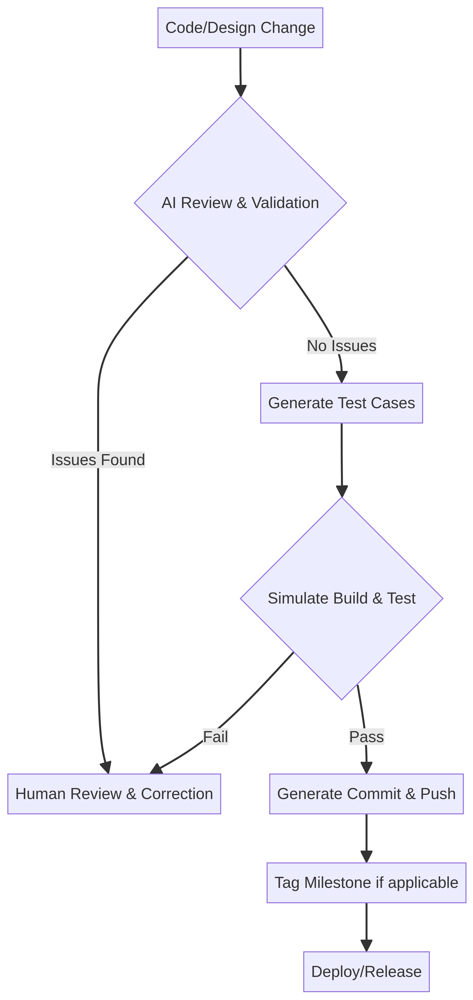

# DevOps and System Architecture Plan for OfflineKnowledgeGraph

## 1. System Architecture Review

### Current Multi-Language Architecture Evaluation

The `OfflineKnowledgeGraph` repository currently leverages a polyglot architecture, integrating Clojure, Lisp, Mercury, and Kotlin (for Android). This approach allows for the utilization of each language's strengths:

*   **Clojure/Lisp:** Primarily used for knowledge representation and Domain-Specific Language (DSL) logic. This aligns with their functional programming paradigms and suitability for symbolic manipulation.
*   **Mercury:** Employed for logic and reasoning, capitalizing on its declarative and logic programming capabilities.
*   **Kotlin:** Dedicated to Android UI and platform integration, leveraging its modern features and seamless interoperability with the Android ecosystem.

While this multi-language strategy offers flexibility and optimizes for specific tasks, it introduces complexities in terms of inter-language communication, build processes, and dependency management. The current structure suggests a loosely coupled system where each language component handles a specific domain, as evidenced by the distinct directories for `clojure`, `lisp_reasoning`, and `mercury_infer` within the `KnowledgeGraph` module.

### Modular Architecture Definition

To maintain modularity and leverage language strengths, the system will be structured around a core Rust engine with well-defined interfaces for other language components. This will ensure clear separation of concerns and facilitate independent development and testing of each module. The architecture will comprise:

*   **Rust Core:** The central performance layer and core system engine, responsible for high-performance data processing, graph operations, and critical system logic.
*   **Language-Specific Modules:** Clojure, Lisp, and Mercury components will interact with the Rust core via Foreign Function Interfaces (FFI), acting as specialized layers for knowledge representation, DSL logic, and reasoning.
*   **Platform-Specific UI:** Kotlin for Android will handle the mobile user interface, communicating with the Rust core through a well-defined API (likely JNI/FFI).

### Rust Performance Layer Integration

The Rust performance layer will be integrated as a shared library or a set of libraries that can be consumed by the other language components. This involves:

*   **FFI Bridges:** Implementing robust FFI bindings to allow Clojure, Lisp, and Mercury to call Rust functions and vice-versa. For Kotlin/Android, this will involve JNI (Java Native Interface) wrappers around the Rust library.
*   **Data Serialization/Deserialization:** Defining efficient and consistent data exchange formats between Rust and other languages. This could involve using a common serialization library or a custom binary protocol for performance-critical paths.
*   **Error Handling:** Establishing a standardized error handling mechanism across language boundaries to ensure consistent and predictable behavior.

### Language Interaction Model

The interaction model will be based on a client-server or message-passing paradigm, where the Rust core acts as the central service provider. Other language components will make requests to the Rust core for data processing, graph queries, and other core functionalities. Responses will be returned in a defined format. This approach minimizes direct dependencies between non-Rust components and centralizes critical logic within the high-performance Rust layer.

### Communication Protocols

For inter-process communication within the application (e.g., between UI and core, or between different language runtimes if they are separate processes), lightweight and efficient protocols will be used. Options include:

*   **Shared Memory:** For high-throughput data exchange between tightly coupled components.
*   **Message Queues:** For asynchronous communication and decoupling of components.
*   **Local Sockets/Pipes:** For reliable communication between processes on the same device.

### Offline Data Architecture

The offline data architecture will focus on robustness, integrity, and efficient storage. Key considerations include:

*   **Embedded Database:** Utilizing an embedded database (e.g., SQLite, RocksDB) within the Rust core for persistent storage of the knowledge graph data.
*   **Data Replication/Synchronization:** Mechanisms for transferring and importing knowledge graph data between devices, ensuring data consistency and conflict resolution.
*   **Versioning:** Implementing a versioning scheme for the knowledge graph data to track changes and enable rollback capabilities.

### Packaging and Transfer Model

The application will support packaging and exporting selected knowledge graph data into a transferable bundle. This bundle will be:

*   **Self-contained:** Including all necessary data and metadata for independent use.
*   **Compressed:** To minimize file size for efficient transfer.
*   **Encrypted:** To protect sensitive knowledge graph data during transfer and storage.
*   **Versioned:** To ensure compatibility and track the origin of the data.

### Security Model

The security model will address both data at rest and data in transit, as well as application integrity. This includes:

*   **Encryption:** For sensitive knowledge graph data, both within the application and during transfer.
*   **Access Control:** If multi-user scenarios are considered, implementing granular access control to knowledge graph segments.
*   **Code Signing:** For executable binaries and application packages to verify authenticity and prevent tampering.
*   **Sandboxing:** Where possible, isolating components to limit the impact of potential vulnerabilities.

### Versioning and Integrity Model

*   **Semantic Versioning:** Applying semantic versioning to the application and knowledge graph data bundles to clearly communicate changes and ensure compatibility.
*   **Checksums/Hashes:** Using cryptographic hashes to verify the integrity of knowledge graph data and application binaries.
*   **Digital Signatures:** For application releases and data bundles to ensure authenticity and non-repudiation.

## 2. DevOps Strategy

### GitHub Repository Structure

The repository will adopt a monorepo-like structure to manage the multi-language codebase effectively. The root will contain the main project configuration, and subdirectories will house each language-specific module and platform-specific UI. This structure facilitates shared CI/CD pipelines and consistent tooling.

```
OfflineKnowledgeGraph/
├── .github/
│   └── workflows/
├── rust-core/
├── clojure-logic/
├── lisp-reasoning/
├── mercury-inference/
├── android-app/
├── docs/
├── scripts/
└── README.md
```

### Branching Strategy

A GitFlow-like branching strategy will be employed to manage development, features, releases, and hotfixes. This provides a structured approach to collaboration and release management.

*   **`main` branch:** Represents the stable, production-ready codebase. Only tagged releases are merged here.
*   **`develop` branch:** Integrates all new features and serves as the main development branch.
*   **`feature/*` branches:** Short-lived branches for new features, branched from `develop`.
*   **`release/*` branches:** Created from `develop` for release preparation, bug fixes, and final testing.
*   **`hotfix/*` branches:** Created from `main` for urgent production bug fixes.

### Milestone Tagging Strategy

Milestones will be tagged using semantic versioning (e.g., `v1.0.0`, `v1.1.0-beta`). Tags will be applied to the `main` branch upon successful release. Pre-release tags (e.g., `-alpha`, `-beta`, `-rc`) will be used for release candidates on `release/*` branches.

### Release Workflow

1.  **Feature Completion:** Features are developed on `feature/*` branches and merged into `develop`.
2.  **Release Branch Creation:** A `release/vX.Y.Z` branch is created from `develop`.
3.  **Testing and Stabilization:** Extensive testing, bug fixing, and documentation updates occur on the `release` branch.
4.  **Version Bumping:** Application version is updated.
5.  **Merge to Main:** The `release` branch is merged into `main` and `develop`.
6.  **Tagging:** A semantic version tag (`vX.Y.Z`) is applied to the `main` branch.
7.  **Artifact Generation:** CI/CD pipeline triggers to build and package release artifacts.
8.  **Release Notes:** Automated generation of release notes from commit messages.

### GitHub Actions Pipeline

GitHub Actions will be the core of the CI/CD pipeline, automating builds, tests, and deployments across multiple platforms. The pipeline will be defined in YAML files within the `.github/workflows/` directory.

### Build Matrix for Windows, Linux, Android

The GitHub Actions workflow will utilize a build matrix to compile the application for Windows, Linux, and Android simultaneously. This ensures consistent builds across all target platforms.

```yaml
name: Cross-Platform Build

on:
  push:
    tags:
      - 'v*.*.*'
  workflow_dispatch:

jobs:
  build:
    runs-on: ubuntu-latest
    strategy:
      matrix:
        os: [windows-latest, ubuntu-latest]
        target: [x86_64-pc-windows-gnu, x86_64-unknown-linux-gnu]
        include:
          - os: macos-latest # For iOS/macOS if needed later
            target: aarch64-apple-darwin
          - os: ubuntu-latest # Android build
            target: aarch64-linux-android

    steps:
      - uses: actions/checkout@v4

      - name: Install Rust toolchain
        uses: dtolnay/rust-toolchain@stable
        with:
          target: ${{ matrix.target }}

      - name: Install Android NDK (for Android build)
        if: contains(matrix.target, 'android')
        run: |
          sudo apt-get update
          sudo apt-get install -y openjdk-17-jdk
          # Install Android SDK and NDK
          # ... (detailed steps for NDK setup)

      - name: Build Rust Core
        run: cargo build --release --target ${{ matrix.target }}
        working-directory: ./rust-core

      - name: Build Android App
        if: contains(matrix.target, 'android')
        run: ./gradlew assembleRelease
        working-directory: ./android-app

      - name: Package Windows Executable
        if: contains(matrix.os, 'windows')
        run: |
          # ... (packaging steps for Windows)

      - name: Package Linux Binary/AppImage
        if: contains(matrix.os, 'ubuntu') && !contains(matrix.target, 'android')
        run: |
          # ... (packaging steps for Linux)

      - name: Upload Artifacts
        uses: actions/upload-artifact@v4
        with:
          name: ${{ matrix.os }}-${{ matrix.target }}-artifacts
          path: |
            ./rust-core/target/${{ matrix.target }}/release/
            ./android-app/build/outputs/apk/release/
```

### Artifact Generation

Build artifacts will include:

*   **Windows:** Executable (`.exe`), installer (`.msi` or `.exe`).
*   **Linux:** Binary executable, AppImage, or `.deb`/`.rpm` packages.
*   **Android:** APK (`.apk`) and Android App Bundle (`.aab`).

These artifacts will be uploaded to GitHub Releases as part of the CI/CD pipeline.

### Versioning System

Semantic Versioning (SemVer) will be used for all application releases. This ensures clear communication of changes and helps manage dependencies. The version will be managed in a central configuration file (e.g., `Cargo.toml` for Rust, `build.gradle` for Android) and updated as part of the release workflow.

### Dependency Management

*   **Rust:** Cargo will manage Rust dependencies.
*   **Clojure/Lisp/Mercury:** Each language will use its native dependency management system (e.g., Leiningen/Gradle for Clojure, Quicklisp for Lisp, Mercury's build system).
*   **Android:** Gradle will manage Kotlin/Java dependencies.

Dependency scanning tools will be integrated into the CI/CD pipeline to identify and mitigate vulnerabilities.

### Security Scanning

Automated security scanning will be performed at various stages of the development lifecycle:

*   **Static Application Security Testing (SAST):** Tools like `cargo-audit` for Rust, and similar tools for other languages, will scan source code for vulnerabilities.
*   **Dependency Scanning:** Tools like Dependabot or Snyk will monitor and alert on vulnerable dependencies.
*   **Container Scanning:** If Docker containers are used for builds, container images will be scanned for vulnerabilities.

### Testing Pipeline

The testing pipeline will include unit, integration, and end-to-end tests across all components and platforms.

*   **Unit Tests:** Executed for each module in its respective language.
*   **Integration Tests:** Verifying the interaction between different language components and the Rust core.
*   **Cross-Platform Tests:** Automated UI tests for Android, and functional tests for Windows and Linux builds.

### Build Verification

After each build, automated verification steps will be performed:

*   **Checksum Verification:** Ensuring the integrity of generated artifacts.
*   **Basic Functionality Tests:** Running a suite of essential tests on the built artifacts to confirm basic functionality.
*   **Installation Tests:** For Windows and Linux installers, verifying successful installation.

## 3. Cross-Platform Build Strategy

### Windows Build

*   **Executable Packaging:** The Rust core will be compiled into a standalone executable or a dynamic link library (DLL). A thin wrapper (e.g., in C++ or a scripting language) might be used to launch the Rust core and interact with it.
*   **Installer:** An installer (e.g., WiX Toolset, Inno Setup) will be created to package the Rust executable/DLL, any necessary runtime components, and potentially a simple GUI (if not using a web-based UI).

### Linux Build

*   **Binary:** The Rust core will be compiled into a static or dynamic executable.
*   **AppImage or Package:** For distribution, an AppImage will be generated for broad compatibility, or `.deb`/`.rpm` packages for specific distributions.

### Android Build

*   **APK/AAB:** The Kotlin Android application will be built into an APK (Android Package Kit) and an AAB (Android App Bundle) for distribution on Google Play.
*   **Offline Support:** The Android application will be designed to function completely offline, relying on the embedded database and local resources.

### Build Tools

*   **Rust:** Cargo (Rust's build system and package manager).
*   **Kotlin/Android:** Gradle (Android's build system).
*   **Clojure/Lisp/Mercury:** Their respective build tools (e.g., Leiningen for Clojure, Quicklisp for Lisp, Mercury's `mmc` compiler).

### Rust Cross-Compilation

Rust's excellent cross-compilation capabilities will be leveraged. The `rustup` toolchain manager will be used to install target-specific toolchains (e.g., `x88_64-pc-windows-gnu`, `aarch64-linux-android`). The `cross` tool (a wrapper around `cargo`) will simplify cross-compilation within the GitHub Actions environment.

### Kotlin Android Build

The Android application will be built using Gradle. The `build.gradle` files will be configured to include the Rust shared library (via JNI) and manage Kotlin/Java dependencies.

### Clojure/Lisp/Mercury Integration

*   **Clojure/Lisp:** These components will likely be compiled into JAR files or native executables (if possible) and integrated with the Rust core via FFI. For Android, Clojure might run on the JVM and interact with the Rust core via JNI.
*   **Mercury:** Mercury code will be compiled to C and then linked with the Rust core, or directly integrated via FFI if a suitable binding exists.

### Artifact Bundling

Final artifacts will be bundled to include:

*   The main application executable/APK/AAB.
*   All necessary shared libraries (Rust, Clojure, Lisp, Mercury runtimes).
*   Configuration files.
*   Initial knowledge graph data (if applicable).

## 4. Offline Knowledge Graph Packaging

### Portable Knowledge Bundle Format

The portable knowledge bundle will be a single file archive with a custom extension (e.g., `.okg`). It will contain:

*   **Structured Knowledge:** The knowledge graph data in a standardized, machine-readable format (e.g., JSON-LD, RDF, custom binary format).
*   **Metadata:** Information about the bundle, including version, creation date, author, and schema version.
*   **Encryption Key (optional):** If encrypted, metadata about the encryption method and potentially a key derivation salt.

### Compression

The bundle will be compressed using a widely supported and efficient algorithm (e.g., Zstandard, Gzip) to reduce file size and improve transfer speeds.

### Encryption

Sensitive knowledge graph data within the bundle will be encrypted using strong, modern encryption algorithms (e.g., AES-256). The encryption key will be derived from a user-provided passphrase or a secure key management system.

### Metadata

Metadata will be stored in a separate, unencrypted section of the bundle or within the encrypted section if its contents are also sensitive. It will include:

*   `bundle_version`: Version of the bundle format.
*   `app_version`: Compatible application version.
*   `creation_date`: Timestamp of bundle creation.
*   `author`: Creator of the bundle.
*   `description`: Optional description of the knowledge graph content.
*   `schema_version`: Version of the knowledge graph schema.
*   `encryption_method`: Algorithm used for encryption (if any).
*   `integrity_hash`: Hash of the unencrypted data for integrity verification.

### Versioning

Each knowledge bundle will have an internal version number, allowing the application to manage different versions of imported knowledge graphs and handle schema migrations.

### Dependency Tracking

If the knowledge graph has external dependencies (e.g., ontologies, external datasets), these will be tracked within the bundle's metadata to ensure all necessary components are present upon import.

### Integrity Verification

Upon import, the integrity of the bundle will be verified using cryptographic hashes (e.g., SHA256) to detect any tampering or corruption during transfer.

### Import/Export Workflow

*   **Export:** Users select knowledge graph segments to export, specify encryption options, and choose a destination for the `.okg` file.
*   **Import:** Users select an `.okg` file, provide a passphrase (if encrypted), and the application imports the data, performing integrity checks and schema migrations as needed.

### File Structure Example

```
knowledge_bundle.okg
├── metadata.json
├── encrypted_data.bin
└── integrity_hash.txt
```

## 5. Rust Performance Layer

### Rust Core Engine Design

The Rust core will be designed as a high-performance, concurrent, and memory-safe engine for knowledge graph operations. It will encapsulate:

*   **Graph Data Structures:** Efficient implementations of graph data structures (e.g., adjacency lists, property graphs).
*   **Query Engine:** Optimized query processing for knowledge graph traversal and pattern matching.
*   **Reasoning Engine Integration:** Providing an interface for the Mercury reasoning engine to leverage Rust's performance for computationally intensive tasks.
*   **Persistence Layer:** Managing interactions with the embedded database for data storage and retrieval.
*   **Concurrency Primitives:** Utilizing Rust's concurrency features (e.g., `rayon`, `tokio`) for parallel processing of graph operations.

### FFI Bridges

FFI bridges will be implemented using Rust's `extern 
C" interface to expose functions to Clojure, Lisp, and Mercury. For Kotlin/Android, `jni` crate will be used to generate JNI bindings.

### Communication with Clojure/Lisp/Mercury

Communication will occur through the FFI. Rust functions will expose a C-compatible API that can be called from Clojure, Lisp, and Mercury. Data will be passed across the FFI boundary using primitive types or carefully managed memory pointers to avoid data copying and ensure memory safety.

### Android Integration

For Android, the Rust core will be compiled as a shared library (`.so` file). Kotlin code will then load this library and interact with it via JNI. This allows the high-performance Rust core to be seamlessly integrated into the Android application.

### Data Processing Pipeline

The data processing pipeline within the Rust core will handle:

*   **Ingestion:** Efficiently parsing and loading knowledge graph data.
*   **Transformation:** Applying data transformations and normalization rules.
*   **Indexing:** Creating optimized indices for fast querying and retrieval.
*   **Query Execution:** Executing complex graph queries and returning results.

### Reasoning Acceleration

Rust will accelerate the Mercury reasoning engine by providing high-performance primitives for graph traversal, pattern matching, and constraint satisfaction. This offloads computationally intensive tasks from Mercury, allowing it to focus on declarative logic.

### Memory Safety Model

Rust's ownership and borrowing system will ensure memory safety and prevent common programming errors like null pointer dereferences and data races. This is crucial for a high-performance core engine that handles complex data structures.

### Migration Strategy

The migration to a Rust core will occur gradually:

1.  **Phase 1: Proof of Concept:** Implement a small, critical component of the knowledge graph in Rust and integrate it with an existing language (e.g., Clojure) via FFI.
2.  **Phase 2: Incremental Migration:** Gradually port more components to Rust, prioritizing performance-critical sections.
3.  **Phase 3: Full Integration:** Once the Rust core is stable and feature-complete, fully integrate it across all platforms and language components.

## 6. AI Automation Framework

Manus.ai will play a critical role in automating various aspects of the development lifecycle, ensuring quality, consistency, and adherence to architectural principles.

### Review Architecture

Manus.ai will review architectural decisions by analyzing design documents, code changes, and proposed solutions. It will identify potential issues, suggest improvements, and ensure alignment with the overall system vision.

### Validate Decisions

Manus.ai will validate technical decisions by:

*   **Verifying Technical Correctness:** Checking code for adherence to best practices, language idioms, and performance considerations.
*   **Detecting Hallucinations:** Analyzing AI-generated code and documentation for factual inaccuracies or inconsistencies.
*   **Performing Alignment Checks:** Ensuring that implementations align with design specifications and user requirements.
*   **Validating Dependencies:** Checking for compatible versions, licenses, and potential security vulnerabilities in dependencies.
*   **Confirming Compatibility:** Verifying that changes are compatible across different platforms and language components.

### Generate Code

Manus.ai will generate commit-ready code snippets, modules, or even entire components based on high-level specifications. This will accelerate development and reduce manual coding effort.

### Check Hallucinations and Perform Alignment Checks

Before any AI-generated implementation is applied, Manus.ai will perform rigorous hallucination detection and alignment checks. This involves:

*   **Semantic Analysis:** Understanding the intent of the generated code and comparing it against the requirements.
*   **Contextual Validation:** Ensuring the generated code fits seamlessly into the existing codebase and adheres to established patterns.
*   **Test Case Generation:** Automatically generating test cases to validate the correctness and behavior of AI-generated code.

### Verify Dependencies

Manus.ai will verify dependencies by:

*   **Scanning for Vulnerabilities:** Using security scanning tools to identify known vulnerabilities in libraries and packages.
*   **License Compliance:** Checking that all dependencies have compatible licenses.
*   **Version Compatibility:** Ensuring that dependency versions are compatible with each other and with the target platforms.

### Simulate Builds and Run Tests

Manus.ai will simulate builds and run tests in a sandboxed environment to validate the correctness and stability of AI-generated changes before they are committed to the repository. This includes:

*   **Unit Tests:** Executing unit tests for affected modules.
*   **Integration Tests:** Running integration tests to verify inter-component communication.
*   **Cross-Platform Builds:** Simulating builds for Windows, Linux, and Android to catch platform-specific issues.

### Generate Commits, Push to Repository, and Tag Milestones

Upon successful validation, Manus.ai will:

*   **Generate Structured Commit Messages:** Creating clear, concise, and informative commit messages that adhere to conventional commit guidelines.
*   **Push Changes:** Pushing the validated code changes to the appropriate branch in the GitHub repository.
*   **Tag Milestones:** Automatically tagging major milestones and releases based on predefined rules and semantic versioning.

### AI Validation Pipeline



### AI Decision Approval Flow

AI-generated changes will follow an approval flow:

1.  **AI Proposal:** Manus.ai proposes a change (code, architecture update, etc.) with a detailed risk assessment, verification steps, and rollback plan.
2.  **Automated Checks:** Automated checks (linting, basic tests, security scans) are performed.
3.  **Human Review:** A human engineer reviews the AI's proposal, risk assessment, and verification results.
4.  **Approval/Rejection:** The human engineer approves or rejects the proposal. If approved, Manus.ai proceeds with implementation. If rejected, Manus.ai incorporates feedback and re-proposes.

### AI Implementation Governance

*   **Transparency:** All AI-generated changes will be clearly marked and auditable.
*   **Human Oversight:** Human engineers will always have the final say on AI-generated implementations.
*   **Feedback Loop:** A continuous feedback loop will be established to improve Manus.ai's accuracy and effectiveness.

## 7. GitHub Milestone Automation

### Commit → Push → Tag Workflow

This workflow will be automated using GitHub Actions to ensure consistency and adherence to versioning policies.

1.  **Commit:** Developers commit changes to feature branches.
2.  **Push:** Changes are pushed to the remote repository.
3.  **Pull Request:** A pull request is created and merged into `develop` after review.
4.  **Merge to Main/Release:** When `develop` is ready for a release, it's merged into `main` (or a `release` branch).
5.  **Tagging:** A GitHub Action automatically creates a semantic version tag on the `main` branch.

### Milestone Tagging Rules

*   **Major Releases (vX.0.0):** Significant new features, architectural changes, or breaking changes.
*   **Minor Releases (vX.Y.0):** New features that are backward-compatible.
*   **Patch Releases (vX.Y.Z):** Bug fixes and small improvements that are backward-compatible.

### Release Tagging

Release tags will follow semantic versioning (e.g., `v1.0.0`). Pre-release tags (e.g., `v1.0.0-alpha.1`, `v1.0.0-beta.2`) will be used for testing and feedback before a stable release.

### Semantic Versioning

All releases will adhere to Semantic Versioning 2.0.0 (SemVer). This provides a clear and consistent way to communicate changes and manage dependencies.

### Automated Changelog

A GitHub Action will automatically generate a `CHANGELOG.md` file based on conventional commit messages. This provides a clear history of changes for each release.

### Release Notes Generation

Upon tagging a new release, a GitHub Action will automatically generate release notes, including a summary of new features, bug fixes, and any breaking changes. These notes will be published with the GitHub Release.

### Rollback Tagging

In case of critical issues in a release, a rollback tag (e.g., `v1.0.0-rollback.1`) can be applied to revert to a previous stable state. This provides a clear mechanism for disaster recovery.

### GitHub Actions Examples

```yaml
name: Release Automation

on:
  push:
    tags:
      - 'v*.*.*'

jobs:
  release:
    runs-on: ubuntu-latest
    steps:
      - uses: actions/checkout@v4
        with:
          fetch-depth: 0

      - name: Generate Changelog
        id: changelog
        uses: github-actions-ecosystem/action-generate-changelog@v1
        with:
          # ... configuration for changelog generation

      - name: Create Release
        id: create_release
        uses: actions/create-release@v1
        env:
          GITHUB_TOKEN: ${{ secrets.GITHUB_TOKEN }}
        with:
          tag_name: ${{ github.ref }}
          release_name: Release ${{ github.ref }}
          body: ${{ steps.changelog.outputs.changelog }}
          draft: false
          prerelease: false

      - name: Upload Release Asset
        uses: actions/upload-release-asset@v1
        env:
          GITHUB_TOKEN: ${{ secrets.GITHUB_TOKEN }}
        with:
          upload_url: ${{ steps.create_release.outputs.upload_url }}
          asset_path: ./path/to/your/artifact.zip
          asset_name: artifact.zip
          asset_content_type: application/zip
```

## 8. Security and Reliability

### Dependency Scanning

Automated dependency scanning will be integrated into the CI/CD pipeline using tools like Dependabot, Snyk, or GitHub's native dependency scanning. This will identify and alert on known vulnerabilities in third-party libraries and packages across all languages (Rust, Clojure, Lisp, Mercury, Kotlin).

### Supply Chain Protection

*   **Trusted Registries:** Only use trusted package registries (e.g., crates.io, Maven Central) and verify package authenticity.
*   **Pinning Dependencies:** Pin exact versions of dependencies to prevent unexpected updates and ensure reproducible builds.
*   **Software Bill of Materials (SBOM):** Generate SBOMs for all releases to provide a comprehensive list of all components and their origins.

### Offline Security Model

For an offline application, the security model focuses on protecting data at rest and ensuring application integrity.

*   **Data Encryption:** Encrypt sensitive knowledge graph data stored locally on the device.
*   **Secure Storage:** Utilize platform-specific secure storage mechanisms (e.g., Android Keystore, Windows Data Protection API) for encryption keys and sensitive configuration.
*   **Access Control:** Implement robust access control mechanisms if multiple users or different levels of data access are introduced.

### Code Verification

*   **Static Analysis:** Use static analysis tools (e.g., Clippy for Rust, linters for other languages) to enforce coding standards and identify potential security flaws.
*   **Code Reviews:** Conduct thorough code reviews to catch logical errors and security vulnerabilities.
*   **Formal Verification (where applicable):** For critical components, consider formal verification methods to mathematically prove correctness and absence of bugs.

### Artifact Verification

*   **Digital Signatures:** Sign all release artifacts (executables, installers, APKs) with a trusted digital certificate to verify their authenticity and integrity.
*   **Checksums:** Publish checksums (e.g., SHA256) for all artifacts, allowing users to verify that their downloaded files have not been tampered with.

### Integrity Validation

*   **Runtime Integrity Checks:** Implement runtime checks to detect if the application's code or data has been tampered with.
*   **Self-Healing Mechanisms:** For certain types of corruption, implement mechanisms to restore data from backups or repair corrupted files.

### Tamper Protection

*   **Obfuscation:** For sensitive code sections, consider code obfuscation techniques to make reverse engineering more difficult.
*   **Anti-Tampering Measures:** Implement measures to detect and respond to attempts to modify the application's binaries or runtime environment.

### Sandboxing

*   **Android Sandboxing:** Leverage Android's built-in application sandboxing to isolate the application from other apps and the underlying system.
*   **OS-Level Sandboxing:** For Windows and Linux, explore containerization (e.g., Docker, Flatpak) or other sandboxing technologies to limit the application's privileges and access to system resources.

### Android Security

*   **Permissions:** Request only necessary Android permissions and explain their usage to users.
*   **Secure Communication:** Use secure communication protocols (HTTPS) for any external communication (though the primary focus is offline).
*   **Data Protection:** Utilize Android's data protection features for sensitive user data.

### Windows/Linux Security

*   **Least Privilege:** Run the application with the minimum necessary privileges.
*   **Firewall Rules:** Document and recommend appropriate firewall rules for any network-enabled components.
*   **Regular Updates:** Ensure all dependencies and system libraries are regularly updated to patch known vulnerabilities.

## 9. Implementation Roadmap

This roadmap outlines a phased approach to converting the `OfflineKnowledgeGraph` repository into a fully functional cross-platform application.

### Phase 1: Architecture Stabilization

*   **Deliverables:** Detailed architectural design document, FFI prototypes for Rust-Clojure/Lisp/Mercury interaction, initial Rust core module with basic graph operations.
*   **Milestones:** Completion of architectural review, successful FFI proof-of-concept, basic Rust graph module functional.
*   **GitHub Tags:** `v0.1.0-alpha` (initial architecture), `v0.2.0-alpha` (FFI PoC), `v0.3.0-alpha` (basic Rust core).
*   **Risks:** Complexity of multi-language FFI, performance overhead of inter-language communication.
*   **Success Criteria:** Clear architectural blueprint, demonstrable inter-language communication, Rust core performing basic graph operations efficiently.

### Phase 2: Rust Core Engine Development

*   **Deliverables:** Feature-complete Rust core engine (query engine, persistence layer, reasoning acceleration interfaces), comprehensive unit and integration tests for Rust core.
*   **Milestones:** Core graph data structures implemented, query engine functional, embedded database integrated, reasoning acceleration interfaces defined.
*   **GitHub Tags:** `v0.4.0-beta` (query engine), `v0.5.0-beta` (persistence), `v0.6.0-beta` (reasoning interfaces).
*   **Risks:** Performance bottlenecks in Rust core, integration challenges with existing language components.
*   **Success Criteria:** Rust core meeting performance targets, all core functionalities implemented and thoroughly tested.

### Phase 3: Cross-Platform Builds

*   **Deliverables:** Automated CI/CD pipeline for Windows, Linux, and Android builds, functional executables/packages for all target platforms, basic UI integration for Android.
*   **Milestones:** GitHub Actions workflow configured, successful cross-compilation for all platforms, Android APK/AAB generated and runnable, Windows/Linux executables functional.
*   **GitHub Tags:** `v0.7.0-beta` (CI/CD setup), `v0.8.0-beta` (cross-platform builds), `v0.9.0-beta` (Android UI integration).
*   **Risks:** Platform-specific build issues, NDK/toolchain complexities, UI integration challenges.
*   **Success Criteria:** Reproducible builds for all platforms, basic application launch and interaction on Windows, Linux, and Android.

### Phase 4: Knowledge Packaging

*   **Deliverables:** Implementation of knowledge bundle format (compression, encryption, metadata), import/export functionality, integrity verification.
*   **Milestones:** Bundle format defined, export working, import working, integrity checks passing.
*   **GitHub Tags:** `v1.0.0-rc.1` (bundle format), `v1.0.0-rc.2` (import/export), `v1.0.0-rc.3` (integrity).
*   **Risks:** Data corruption during packaging/transfer, performance of encryption/compression, schema evolution.
*   **Success Criteria:** Secure and reliable packaging and transfer of knowledge graph data.

### Phase 5: AI Automation

*   **Deliverables:** Integration of Manus.ai for architecture review, decision validation, code generation, and CI/CD automation, AI validation pipeline implemented.
*   **Milestones:** AI review of architectural changes, AI-generated code successfully integrated, automated hallucination/alignment checks, AI-driven commit/push/tag workflow.
*   **GitHub Tags:** `v1.1.0-alpha` (AI review), `v1.2.0-alpha` (AI code gen), `v1.3.0-alpha` (AI CI/CD).
*   **Risks:** AI hallucination, false positives in validation, integration complexity with existing workflows.
*   **Success Criteria:** Manus.ai effectively assisting in development, improving code quality and accelerating delivery.

### Phase 6: Security Hardening

*   **Deliverables:** Comprehensive security audit, implementation of all security recommendations (dependency scanning, supply chain protection, tamper protection, sandboxing), detailed security documentation.
*   **Milestones:** Security audit completed, all critical vulnerabilities addressed, security features implemented.
*   **GitHub Tags:** `v1.4.0-beta` (security audit), `v1.5.0-beta` (hardening), `v1.6.0-beta` (documentation).
*   **Risks:** New vulnerabilities discovered, performance impact of security measures, complexity of implementing advanced security features.
*   **Success Criteria:** Application meeting defined security standards, robust protection against common threats.

### Phase 7: Production Release

*   **Deliverables:** Stable, fully tested cross-platform application, comprehensive user documentation, public release.
*   **Milestones:** Final testing and bug fixing, documentation complete, application deployed to target platforms.
*   **GitHub Tags:** `v2.0.0` (production release).
*   **Risks:** Unforeseen production issues, user adoption challenges.
*   **Success Criteria:** Successful launch, positive user feedback, stable operation in production.

## 10. AI Execution Instructions

Manus.ai will operate as an intelligent assistant throughout the development lifecycle, following these step-by-step instructions:

1.  **Review:** Upon any proposed change (code, design document, pull request), Manus.ai will initiate a review process. It will analyze the change against the established architectural principles, coding standards, and security guidelines. This includes evaluating the multi-language interaction model, Rust core design, and cross-platform compatibility.

2.  **Validate:** Manus.ai will validate the proposed changes by:
    *   **Technical Correctness:** Checking for syntax errors, logical flaws, and adherence to language-specific best practices.
    *   **Hallucination Detection:** Comparing AI-generated content (code, documentation) against factual knowledge and project context to identify and flag inconsistencies or inaccuracies.
    *   **Alignment Checks:** Ensuring that the proposed changes align with the overall project vision, architectural roadmap, and user requirements.
    *   **Dependency Verification:** Scanning for new or updated dependencies to ensure compatibility, license compliance, and absence of known vulnerabilities.
    *   **Build Simulation:** Triggering simulated builds for all target platforms (Windows, Linux, Android) to detect potential build failures or integration issues early.
    *   **Test Execution:** Running relevant unit, integration, and end-to-end tests to verify the functional correctness and stability of the changes.

3.  **Implement:** If the validation checks pass and human approval is granted (for significant changes), Manus.ai will proceed with implementation. This may involve:
    *   **Code Generation:** Generating new code snippets, refactoring existing code, or creating boilerplate based on specifications.
    *   **Configuration Updates:** Modifying build scripts, CI/CD workflows, or deployment configurations.
    *   **Documentation Updates:** Updating design documents, READMEs, and user manuals to reflect the changes.

4.  **Commit:** Manus.ai will generate a structured commit message for the implemented changes, adhering to conventional commit guidelines. The commit message will include a summary of the changes, their impact, and references to relevant issues or tasks.

5.  **Push:** Manus.ai will push the committed changes to the appropriate branch in the GitHub repository. This action will trigger the CI/CD pipeline for further automated checks and artifact generation.

6.  **Tag:** For major milestones or releases, Manus.ai will automatically apply semantic version tags to the `main` branch, following the defined tagging rules. This ensures proper version control and facilitates release management.

7.  **Verify:** After pushing and tagging, Manus.ai will monitor the CI/CD pipeline execution to verify that all builds pass, tests are successful, and artifacts are generated correctly. It will also perform post-deployment checks if applicable.

8.  **Monitor:** Continuously monitor the application's performance, stability, and security in development and production environments. This includes tracking metrics, logs, and alerts to identify and address issues proactively.

9.  **Iterate Safely:** Manus.ai will operate in an iterative loop, continuously reviewing, validating, implementing, and monitoring changes. Each iteration will incorporate feedback and lessons learned to improve the overall development process and application quality. All implementations will include a risk assessment, verification steps, and a rollback plan to ensure safe and controlled iterations.

## References

[1] The Mercury Project: Home. (n.d.). Retrieved from https://mercurylang.org/
[2] The Mercury Language Reference Manual. (n.d.). Retrieved from https://mercurylang.org/information/doc-release/mercury_ref/index.html
[3] Medium. (n.d.). *Comprehensive Guide to Using Rust in Android Development*. Retrieved from https://medium.com/@ali.alacan/comprehensive-guide-to-using-rust-in-android-development-aae291005334
[4] Mozilla. (n.d.). *How to use Rust Components in Android - Cross-platform*. Retrieved from https://mozilla.github.io/application-services/book/android-faqs.html
[5] sal.dev. (2023, March 20). *Running Rust on Android with UniFFI*. Retrieved from https://sal.dev/android/intro-rust-android-uniffi/
[6] GitHub. (n.d.). *redbadger/crux: Cross-platform app development in Rust*. Retrieved from https://github.com/redbadger/crux
[7] rapidinnovation.io. (n.d.). *Cross-Platform Development with Rust in 2024*. Retrieved from https://www.rapidinnovation.io/post/cross-platform-development-with-rust-desktop-mobile-and-web
[8] Medium. (n.d.). *Rust + Flutter: How to Build Fast, Safe, Cross-Platform Mobile Apps*. Retrieved from https://abibeh.medium.com/rust-flutter-how-to-build-fast-safe-cross-platform-mobile-apps-a509a810bde1
[9] Reddit. (n.d.). *A practical guide to Rust + Java JNI integration*. Retrieved from https://www.reddit.com/r/rust/comments/1krd277/a_practical_guide_to_rust_java_jni_integration/
[10] Medium. (n.d.). *Rust Library Structure for Android: A Deep Dive into JNI Integration*. Retrieved from https://medium.com/@antonio.dias.bastiao/rust-library-structure-for-android-a-deep-dive-into-jni-integration-854e7fdff6cb
[11] GitHub Marketplace. (n.d.). *Build Rust Projects with Cross*. Retrieved from https://github.com/marketplace/actions/build-rust-projects-with-cross
[12] OneUptime. (2026, February 2). *How to Configure GitHub Actions for Multi-Platform Builds*. Retrieved from https://oneuptime.com/blog/post/2026-02-02-github-actions-multi-platform-builds/view
[13] GitHub. (n.d.). *Actions · matrix-org/matrix-android-console*. Retrieved from https://github.com/matrix-org/matrix-android-console/actions
[14] Medium. (2025, January 23). *Write a GitHub Actions Workflow for Rust cross-compilation*. Retrieved from https://medium.com/@mellomello2030/write-a-github-actions-workflow-for-rust-cross-compilation-44284dfa9597
